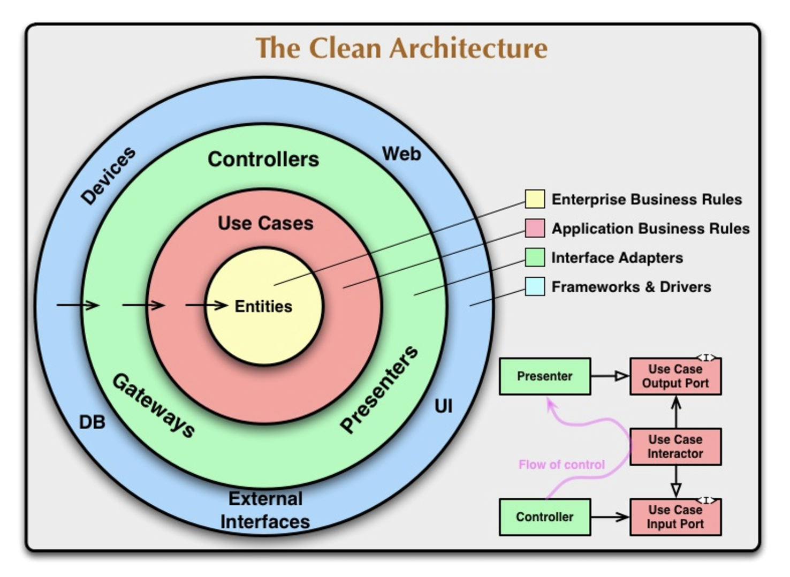
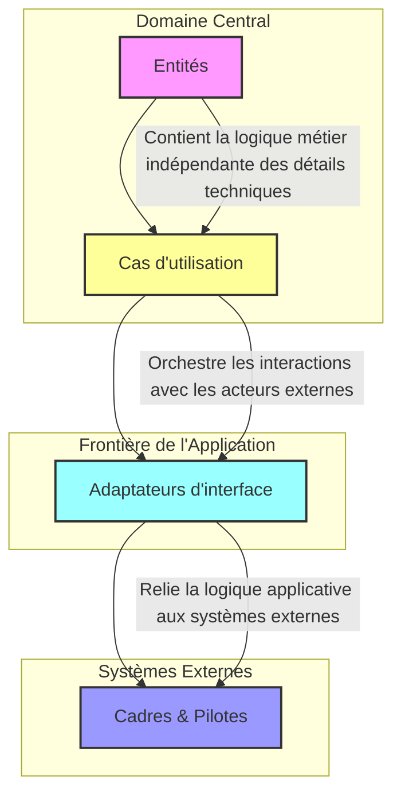
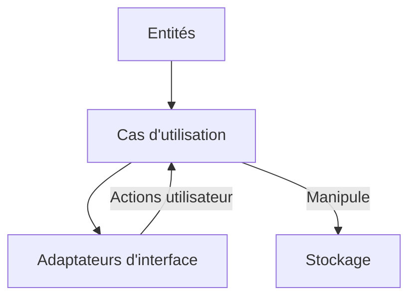

### Introduction à la Clean Architecture 

### Plan du cours général

[plan du cours](../../01_ORGA/00_plan.md)

La **Clean Architecture**, popularisée par Robert C. Martin (Uncle Bob), est une approche qui vise à organiser le code d'une application pour maximiser sa **maintenabilité**, sa **testabilité** et son **évolutivité**. Elle repose sur des principes de séparation des préoccupations en couches distinctes, permettant de rendre les différents aspects de l'application indépendants les uns des autres. Cette architecture est particulièrement adaptée aux projets complexes, où les interactions entre la logique métier, l'interface utilisateur et les systèmes externes doivent être bien structurées.

---



### Objectifs principaux de la Clean Architecture

1. **Indépendance des frameworks** : 
   - L'architecture n'est pas liée à un framework ou une technologie spécifique. Ils deviennent des outils interchangeables.

2. **Facilité de test** :
   - En séparant la logique métier des détails techniques, les tests unitaires sont plus simples à écrire et à maintenir.

3. **Indépendance des interfaces utilisateur** :
   - La logique métier n'est pas affectée par les changements dans l'interface utilisateur ou le système de présentation.

4. **Indépendance des bases de données** :
   - La persistance des données est un détail technique qui n’impacte pas la logique métier.

5. **Indépendance des systèmes externes** :
   - Les intégrations avec des APIs tierces ou des systèmes externes sont isolées et peuvent être facilement modifiées ou remplacées.



---

### Structure en couches

---

### **1. Entités**

- **Responsabilité principale** : Représentent les modèles métier fondamentaux.
- **Règles métier** : Contiennent les règles métier universelles qui ne dépendent d'aucun détail technique.
- **Indépendance des technologies** : Les entités doivent être totalement indépendantes des détails d'implémentation (frameworks, bases de données, etc.).
  
**Principe clé** : Les entités sont au cœur de l'architecture, et doivent être isolées des autres couches pour garantir l'évolutivité et la stabilité du système.

---

### **2. Cas d’utilisation (Use Cases)**

- **Responsabilité principale** : Contiennent la logique métier spécifique à l’application.
- **Interaction avec les entités** : Décrivent les interactions possibles entre les entités et les acteurs externes.
- **Orchestration** : Organisent les flux de travail pour répondre aux besoins des utilisateurs tout en manipulant les entités.
- **Dépendance** : Dépendent des entités, mais ne dépendent pas des couches externes (UI, frameworks, etc.).

>[!NOTE]
>**Principe clé** : Les cas d’utilisation exposent la logique de l’application tout en restant indépendants des détails techniques et des choix d'implémentation.

---

### 🔌 **3. Interface d’adaptation (Interface Adapters)**

- **Responsabilité principale** : Gèrent les conversions entre les cas d'utilisation et les systèmes externes (UI, base de données, APIs, etc.).
- **Médiation** : Agissent comme des intermédiaires pour convertir les données et les requêtes entre le domaine métier et les systèmes externes.
- **Dépendance** : Dépendent des cas d'utilisation, mais doivent être découplés des entités.

**Principe clé** : Cette couche permet d’adapter l’architecture aux besoins spécifiques des systèmes externes, sans affecter le domaine métier central.

---

### 🧩 **4. Frameworks et drivers**

- **Responsabilité principale** : Contiennent les détails d’implémentation technique : frameworks, bibliothèques, interfaces utilisateur, bases de données, etc.
- **Dépendance** : Ce sont les composants les plus externes et peuvent changer sans affecter le cœur du système (les entités et les cas d’utilisation).
  
**Principe clé** : Cette couche contient des détails techniques, mais ne doit jamais affecter la logique métier. Les choix technologiques peuvent évoluer sans perturber le domaine central.

---

### **Principes clés de la Clean Architecture** :

- **Indépendance des détails techniques** : La logique métier (entités et cas d’utilisation) doit être indépendante des technologies externes.
- **Dépendances orientées vers l'intérieur** : Les couches internes ne doivent jamais dépendre des couches externes. Au contraire, les couches externes dépendent toujours des couches internes.
- **Flexibilité et évolutivité** : La séparation claire des responsabilités garantit qu’un changement dans la technologie externe (framework, base de données, UI) n’impacte pas la logique métier.

---

### Exemple d'arborescence clean architecture

```txt
├── adapters
│   ├── api
│   │   ├── main.ts             // Point d'entrée pour démarrer le serveur Express
│   │   └── userRouter.ts       // Définit les routes API liées à l'utilisateur (GET, POST, etc.)
│   ├── controllers
│   │   └── UserController.ts   // Gère la logique des requêtes HTTP pour l'utilisateur, interagit avec les cas d'utilisation
│   └── database
│       └── UserRepositoryImpl.ts  // Implémentation du dépôt d'utilisateurs, simule l'accès à la base de données (ici avec un tableau)
├── app.ts                      // Point d'entrée principal de l'application, configure et lance le serveur après connexion à la DB
├── config
│   └── default.ts              // Contient la configuration par défaut, comme l'URL de la base de données et le port du serveur
├── domain
│   ├── entities
│   │   └── User.ts             // Définition de l'entité "User", qui contient les propriétés et méthodes de l'utilisateur
│   ├── interfaces
│   │   └── UserRepository.ts   // Interface du dépôt d'utilisateurs, définit les méthodes à implémenter pour l'accès aux utilisateurs
│   ├── services
│   │   └── UserService.ts      // Contient la logique métier spécifique à l'utilisateur, par exemple la validation ou le calcul de l'âge
│   └── usecases
│       └── GetUserUseCase.ts  // Cas d'utilisation pour récupérer un utilisateur spécifique ou une liste d'utilisateurs
├── infrastructure
│   ├── database
│   │   └── dbConnection.ts     // Gère la connexion à la base de données, même si ici c'est simulé
│   └── frameworks
│       └── ExpressApp.ts       // Configure et initialise le serveur Express
└── types
    ├── Config.ts              // Définit les types pour la configuration (par exemple, les paramètres du serveur et de la DB)
    └── UserAdulte.ts          // Type pour associer une propriété supplémentaire "adulte" à l'entité User
app.ts                         // Point d'entrée de l'application
.env                           // variable d'environnement
```


```markdown
+-----------------------------------+
|          Infrastructure           |  <-- Couches externes (Frameworks, DB)
|  (Express, Database, etc.)        |
+-----------------------------------+
            |
            | (Adaptateurs implémentant des ports)
            v
+-----------------------------------+
|            Adaptateurs            |  <-- Relient le domaine aux interfaces externes
| (API, Controllers, Repositories)  |
+-----------------------------------+
            |
            | (Appels via les ports)
            v
+-----------------------------------+
|         Logiciel Métier (Domaine) |  <-- Contient la logique métier
| (Entities, UseCases, Ports)       |
+-----------------------------------+
```


### Voir l'exemple 🌀 [app clean](../Examples/clean_architecture.md)

### Les Principes Sous-Jacents

La Clean Architecture s’appuie sur plusieurs principes fondamentaux de développement logiciel, dont :

1. **SOLID** :
   - Chaque classe ou module respecte les principes SOLID pour garantir un code modulaire, réutilisable et robuste.

2. **Dépendance inversée** :
   - Les couches internes (logique métier) ne dépendent jamais des couches externes (frameworks ou bases de données). Les dépendances pointent toujours vers l'intérieur.

3. **Separation of Concerns** :
   - Chaque couche se concentre sur une responsabilité unique.

---

### Pourquoi adopter la Clean Architecture ?

1. **Longévité du projet** : 
   - Une application bien structurée est plus facile à maintenir et à adapter aux besoins changeants.

2. **Équipe modulable** :
   - Les développeurs peuvent travailler indépendamment sur différentes couches sans interférer.

3. **Facilité de migration technologique** :
   - L’indépendance des détails techniques permet de changer un framework ou une base de données sans affecter le reste du code.

---

### Exemple avec en TypeScript et React

#### Exemple 1 : Gestion d'utilisateurs avec une architecture propre

####  React et Zustand

Pour une application de gestion de tâches, voici un exemple structuré :

- **Entités**  
  Chaque tâche est représentée par un objet `Task`.

  ```ts
  interface Task {
      id: string;
      title: string;
      completed: boolean;
  }
  ```

- **Cas d'utilisation**  
  La gestion des tâches est centralisée dans un store Zustand.  

  ```ts
  import { create } from 'zustand';

  interface TasksState {
      tasks: Task[];
      addTask: (title: string) => void;
      toggleTask: (id: string) => void;
  }

  export const useTasksStore = create<TasksState>((set) => ({
      tasks: [],
      addTask: (title: string) =>
          set((state) => ({
              tasks: [
                  ...state.tasks,
                  { id: crypto.randomUUID(), title, completed: false },
              ],
          })),
      toggleTask: (id: string) =>
          set((state) => ({
              tasks: state.tasks.map((task) =>
                  task.id === id ? { ...task, completed: !task.completed } : task
              ),
          })),
  }));
  ```

- **Adaptateurs d’interface**  
  Une interface utilisateur avec des composants React connectés à Zustand.

  ```tsx
  import React from 'react';
  import { useTasksStore } from './tasksStore';

  const TasksList = () => {
      const tasks = useTasksStore((state) => state.tasks);
      const addTask = useTasksStore((state) => state.addTask);
      const toggleTask = useTasksStore((state) => state.toggleTask);

      const handleAddTask = (title: string) => {
          addTask(title);
      };

      const handleToggleTask = (id: string) => {
          toggleTask(id);
      };

      return (
          <div>
              <ul>
                  {tasks.map(task => (
                      <li key={task.id} onClick={() => handleToggleTask(task.id)}>
                          {task.title} {task.completed ? "✔️" : "❌"}
                      </li>
                  ))}
              </ul>
              <button onClick={() => handleAddTask("New Task")}>Add Task</button>
          </div>
      );
  };

  export default TasksList;
  ```

---

### **1. Entités**
**Responsabilité :**  
Les entités sont les objets centraux qui modélisent les données et règles métier de base.

### **2. Cas d'utilisation**
**Responsabilité :**  
Gère les règles spécifiques liées à la manipulation des entités et leur utilisation.

### **3. Adaptateurs d'interface**
**Responsabilité :**  
Connecte l'utilisateur final avec la logique métier via des composants React.

- **Position dans la Clean Architecture :** Couche **Interface utilisateur**.  
- **Rôle :** Fournit une interface pour afficher et interagir avec les données.

---

### **Relations avec la Clean Architecture :**

1. **Dépendance inversée**  
   Les composants React n'interagissent pas directement avec les données ; ils passent par le store Zustand.

2. **Separation of Concerns**  
   - **Entités** : définissent ce qu'est une tâche.  
   - **Cas d'utilisation** : implémentent la logique métier pour manipuler les tâches.  
   - **Interface utilisateur** : affiche les tâches et capte les interactions utilisateur.

### **Schéma Clean Architecture**



**Résumé :**  
- Les **Entités** définissent la structure des données.  
- Les **Cas d'utilisation** contrôlent les règles métier.  
- Les **Adaptateurs d'interface** connectent ces couches au monde extérieur.

## Proposition d'arborescence pour un projet React

```txt

src/
│
├── api/                        # Gestion des appels API
│   └── endpoints/              # Points d'entrée API
│       ├── tasks.ts            # API pour les tâches
│       └── users.ts            # API pour les utilisateurs
│
├── components/                 # Composants React (Atomic Design)
│   ├── atoms/                  # Éléments atomiques (boutons, inputs)
│   │   └── Button.tsx          # Exemple : Composant bouton
│   ├── molecules/              # Combinaisons d'atomes
│   │   └── TaskItem.tsx        # Élément d'une tâche
│   ├── organisms/              # Groupes complexes (listes, formulaires)
│   │   └── TaskList.tsx        # Liste des tâches
│   ├── templates/              # Layouts de page (header, footer)
│   │   └── AppLayout.tsx       # Modèle de mise en page
│   └── pages/                  # Pages complètes
│       ├── HomePage.tsx        # Page d'accueil
│       └── TasksPage.tsx       # Page des tâches
│
├── app/                        # Configuration globale de l'application
│   └── stores/                 # Stores Zustand
│       ├── tasksStore.ts       # Store pour les tâches
│       └── usersStore.ts       # Store pour les utilisateurs
│
├── routes/                     # Gestion des routes de l'application
│
├── hooks/                      # Hooks personnalisés
│   ├── useFetchTasks.ts        # Hook pour récupérer les tâches
│   └── useToggleTask.ts        # Hook pour changer l'état d'une tâche
│
├── utils/                      # Fonctions utilitaires
│   ├── idGenerator.ts          # Génération d'IDs uniques
│   └── apiHelpers.ts           # Aides pour les appels API
│
├── assets/                     # Fichiers statiques (images, styles)
│   └── styles.css              # Fichier CSS global
│
└── main.tsx                    # Point d'entrée principal
```

### Plan du cours général

[plan du cours](../../01_ORGA/00_plan.md)
