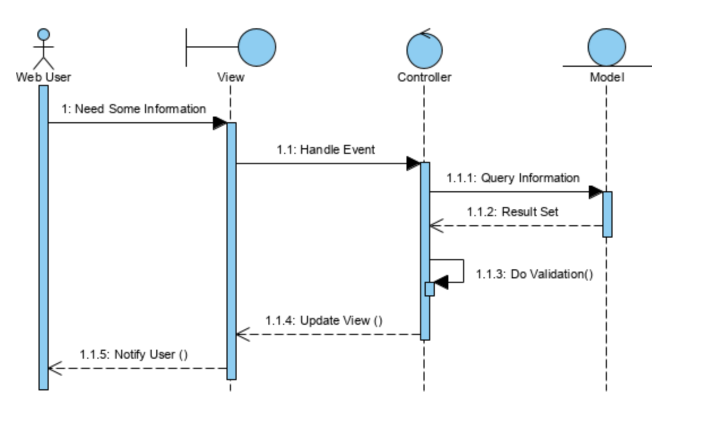

# Exercice — MVC 

## Objectif

Compléter un endpoint `GET /products` dans une structure MVC.

Ce projet, dimensionné pour découvrir MVC from scratch et volontairement réduit dans ses fonctionnalitées, est rédigé en respectant un certains nombres de contraintes du titre CDA.

---

## Environnement fourni

* Stack : Node.js + TypeScript + PostgreSQL
* Table `products` déjà créée et remplie, il y a d'autres tables, voir le fichier `init.sql` dans le dossier `sql` pour permettre de faire des tests cohérents.
* Routing MVC déjà en place

---

## Travail à faire

1. Compléter :

```ts
// src/models/ProductModel.ts
findAll()
```

2. Vérifier que :

```txt
GET /products
```

retourne les 3 produits en JSON

---

## Structure recommandée 

Ordre de lecture conseillé pour un dossier CDA:
1. Product Backlog (vision et priorités)
2. Architecture MVC + API REST
3. Plan de tests (unitaire, fonctionnel, intégration, E2E)
4. Observabilité (Grafana, Loki, Alloy)

---

## Product Backlog 

Objectif produit:
1. Exposer une API produits simple, testable, documentée et observable.

### Epic 1 — Catalogue produits

1. `PBI-01` (Must): En tant qu'utilisateur API, je veux lister les produits via `GET /products`.
Critères d'acceptation:
1. réponse `200`
2. payload JSON `{ data: Product[] }`
3. produits ordonnés par `id`

2. `PBI-02` (Must): En tant qu'utilisateur API, je veux consulter un produit via `GET /products/:id` (`:id` est un UUID).
Critères d'acceptation:
1. `200` si trouvé
2. `404 PRODUCT_NOT_FOUND` si absent
3. `400 PRODUCT_ID_INVALID` si id invalide

### Epic 2 — Gestion de stock

3. `PBI-03` (Must): En tant que gestionnaire, je veux voir l'état du stock d'un produit via `GET /products/:id/stock` (`:id` UUID).
Critères d'acceptation:
1. calcul `available = onHand - reserved`
2. statut `OUT_OF_STOCK | LOW_STOCK | OK`
3. `404` si produit ou inventaire absent

4. `PBI-04` (Should): En tant que gestionnaire, je veux simuler une projection de stock via `POST /products/:id/stock/projection` (`:id` UUID).
Critères d'acceptation:
1. prise en compte `incoming`, `outgoing`, `reserve`, `release`, `adjust`
2. rejet des états incohérents (`INVALID_STOCK_PROJECTION`)
3. réponse `200` avec snapshot projeté si données valides

### Epic 3 — Qualité logicielle

5. `PBI-05` (Must): En tant qu'équipe technique, je veux une stratégie de tests complète.
Critères d'acceptation:
1. unitaires: logique `StockService`
2. fonctionnels: contrat HTTP des routes
3. intégration: SQL réel repository + PostgreSQL
4. E2E: API démarrée + Swagger accessible

6. `PBI-06` (Should): En tant qu'équipe technique, je veux des mocks réutilisables pour isoler la logique.
Critères d'acceptation:
1. factories de mocks repositories
2. tests unitaires indépendants de la DB

### Epic 4 — Documentation API

7. `PBI-07` (Must): En tant qu'utilisateur API, je veux une documentation Swagger exploitable.
Critères d'acceptation:
1. `GET /api-docs` accessible
2. endpoints produits + stock décrits
3. exemples d'erreurs documentés

### Epic 5 — Exploitation / Observabilité

8. `PBI-08` (Should): En tant qu'exploitant, je veux des logs structurés corrélables.
Critères d'acceptation:
1. logs JSON avec `service`, `env`, `level`, `request_id`
2. logs consultables dans Grafana via Loki

9. `PBI-09` (Could): En tant qu'exploitant, je veux une alerte simple sur dérive d'erreurs.
Critères d'acceptation:
1. alerte Grafana si erreurs > seuil sur 5 min
2. règle versionnée dans le repo

### Priorisation release (exemple)

Release 1 (MVP):
1. `PBI-01`, `PBI-02`, `PBI-03`, `PBI-05`, `PBI-07`

Release 2:
1. `PBI-04`, `PBI-06`, `PBI-08`

Release 3:
1. `PBI-09`

### Définition de Done (DoD) commune

1. code relu et compréhensible
2. tests associés passants
3. documentation README et OpenAPI à jour
4. logs exploitables en environnement Docker

### Sprint Backlog (exemple)

## Sprint 1 — MVP API produits

Objectif:
1. livrer un socle API utilisable avec documentation minimale.

PBIs embarqués:
1. `PBI-01`
2. `PBI-02`
3. `PBI-07` (partie produits)

Tâches techniques:
1. implémenter `GET /products` et `GET /products/:id`
2. gérer les statuts `200`, `400`, `404`, `500`
3. documenter les endpoints produits dans OpenAPI
4. vérifier manuellement via Swagger UI et `curl`

Critères de sortie du sprint:
1. endpoints produits opérationnels
2. Swagger accessible sur `/api-docs`
3. tests de non-régression de base passants

## Sprint 2 — Gestion de stock + qualité

Objectif:
1. ajouter la logique métier de stock avec validations robustes.

PBIs embarqués:
1. `PBI-03`
2. `PBI-04`
3. `PBI-05`
4. `PBI-06`

Tâches techniques:
1. implémenter `StockService` (`snapshot`, `projection`, statuts)
2. brancher `GET /products/:id/stock` et `POST /products/:id/stock/projection`
3. ajouter tests unitaires et fonctionnels
4. ajouter tests d'intégration repositories et tests E2E API
5. factoriser les mocks repositories

Critères de sortie du sprint:
1. routes stock opérationnelles
2. erreurs métier gérées (`INVALID_STOCK_PROJECTION`)
3. suites de tests définies et exécutables

## Sprint 3 — Observabilité et exploitation

Objectif:
1. rendre l'application observable et pilotable en exploitation.

PBIs embarqués:
1. `PBI-08`
2. `PBI-09`

Tâches techniques:
1. structurer les logs JSON avec Pino (`service`, `env`, `level`, `request_id`)
2. collecter via Alloy et stocker dans Loki
3. provisionner Grafana (datasource + dashboard)
4. créer une alerte simple `error logs > seuil sur 5 min`
5. documenter la procédure de diagnostic dans le README

Critères de sortie du sprint:
1. dashboard Grafana exploitable
2. alerte visible dans Grafana Alerting
3. procédure de vérification reproductible

### Cadence et pilotage (proposition)

1. sprint de 1 semaine (format pédagogique)
2. daily court: 10 minutes
3. revue de sprint: démo API + tests + dashboard
4. rétrospective: axes d'amélioration techniques et organisationnels

---

## Validation Runtime avec Zod (chapitre étudiant)

### Pourquoi ajouter Zod alors qu'on a TypeScript

1. TypeScript vérifie le code au **compile-time**.
2. Les données HTTP (`req.params`, `req.body`) arrivent de l'extérieur au **runtime**.
3. Zod protège la frontière API: si les données sont invalides, on répond `400` avant la logique métier.

Résumé:
1. TS protège le code interne.
2. Zod protège les entrées externes.

### Ce qu'on a mis en place dans ce projet

1. Schémas Zod:
   - `src/schemas/apiSchemas.ts`
2. Middleware de validation:
   - `src/middlewares/validation.ts`
3. Branchement dans les routes:
   - `src/routes/productRoutes.ts`

### Schémas validés

1. `productIdParamsSchema`
   - valide `:id` au format UUID
2. `stockProjectionBodySchema`
   - valide le payload de projection (`incoming`, `outgoing`, `reserve`, `release`, `adjust`)
   - impose des entiers positifs là où c'est attendu
   - refuse les champs inattendus (`strict()`)

### Matrice de validation par endpoint

| Endpoint | Validation | Erreur 400 |
| --- | --- | --- |
| `GET /products/:id` | `params.id` doit être un UUID | `PRODUCT_ID_INVALID` |
| `GET /products/:id/stock` | `params.id` doit être un UUID | `PRODUCT_ID_INVALID` |
| `POST /products/:id/stock/projection` | `params.id` UUID + `body` validé par `stockProjectionBodySchema` | `PRODUCT_ID_INVALID` ou `INVALID_STOCK_PROJECTION` |

Notes:
1. `INVALID_STOCK_PROJECTION` peut venir de la validation Zod (format payload) **ou** du service métier (invariants de stock).
2. La validation est exécutée avant le controller via middleware.

### Endpoint métier: `POST /products/:id/stock/projection` (explication complète)

Cet endpoint sert à **simuler** un futur état de stock.

Ce qu'il fait:
1. lit l'état actuel du stock en base (`onHand`, `reserved`, `reorderPoint`)
2. applique les variations du payload (`incoming`, `outgoing`, `reserve`, `release`, `adjust`)
3. calcule un snapshot projeté (`onHand`, `reserved`, `available`, `status`)
4. retourne le résultat au client

Ce qu'il ne fait pas:
1. il **ne modifie pas** la base de données
2. il **ne crée pas** de commande
3. il **ne réserve pas** réellement le stock

Formules utilisées:
1. `onHand = onHand + incoming - outgoing + adjust`
2. `reserved = reserved + reserve - release`
3. `available = onHand - reserved`

Règles d'incohérence métier:
1. `onHand < 0` -> `INVALID_STOCK_PROJECTION`
2. `reserved < 0` -> `INVALID_STOCK_PROJECTION`
3. `reserved > onHand` -> `INVALID_STOCK_PROJECTION`

Exemple pédagogique:
1. état actuel: `onHand=40`, `reserved=8`
2. payload: `{ "incoming": 10, "outgoing": 5, "reserve": 3 }`
3. projection: `onHand=45`, `reserved=11`, `available=34`
4. statut calculé selon `available` et `reorderPoint`

### Middleware utilisé

1. `validateParams(schema, errorCode)`
2. `validateBody(schema, errorCode)`

Comportement:
1. parse via `safeParse`
2. si invalide -> `400` + code d'erreur + détails
3. si valide -> `next()` vers le controller

### Exemple de flux sur une route

```txt
POST /products/:id/stock/projection
-> validateParams(productIdParamsSchema, "PRODUCT_ID_INVALID")
-> validateBody(stockProjectionBodySchema, "INVALID_STOCK_PROJECTION")
-> StockController.projectByProductId()
-> StockModel -> StockService
```

### Impact sur les controllers

1. moins de `if` de validation manuelle
2. controllers plus lisibles (focus HTTP + orchestration)
3. validation centralisée et réutilisable

### Quand passer à un middleware (et quand éviter)

Utiliser middleware si:
1. plusieurs routes partagent les mêmes validations
2. on veut des erreurs homogènes
3. on veut réduire la duplication

Garder inline dans controller si:
1. projet très petit
2. objectif pédagogique débutant sans abstraction

---

## Commandes

```bash
docker compose up -d --build
```

---

## URLs utiles

* API : [http://localhost:3003](http://localhost:3003)
* Products : [http://localhost:3003/products](http://localhost:3003/products)
* Swagger UI (après ajout) : [http://localhost:3003/api-docs](http://localhost:3003/api-docs)
* Grafana : [http://localhost:3001](http://localhost:3001) (`admin` / `admin`)
* Loki : [http://localhost:3100](http://localhost:3100)
* Alloy UI : [http://localhost:12345](http://localhost:12345)

---

## Observabilité Logs (Grafana + Loki + Alloy)

Stack en place:

1. `grafana` (dashboard + alerting)
2. `loki` (stockage/requêtes logs)
3. `alloy` (collecte des logs app, push vers Loki)

L'app Node produit des logs JSON via Pino avec:

1. `service`
2. `env`
3. `level`
4. `request_id`

Les logs sont écrits:

1. sur `stdout`
2. dans `/var/log/app/app.log` (volume Docker partagé avec Alloy)

### Lancer la stack complète

```bash
docker compose up -d --build
```

### Vérifier rapidement

1. API:

```bash
curl http://localhost:3003/products
curl -X POST http://localhost:3003/products/11111111-1111-4111-8111-111111111111/stock/projection \
  -H "content-type: application/json" \
  -d '{"incoming":10,"outgoing":2}'
```

2. Grafana:

* Ouvrir `http://localhost:3001`
* Vérifier datasource `Loki` (provisionnée automatiquement)
* Ouvrir dashboard `Starter MVC - Logs Overview`

3. Explore logs:

* Requête Loki:

```logql
{service="starter-mvc"}
```

### Alerte provisionnée

Règle: `Too many error logs (5m)`

Condition:

* `sum(count_over_time({service="starter-mvc", level="error"}[5m])) > 5`
* maintenue pendant `5m`

Emplacement:

* Grafana > Alerting > Alert rules > folder `Observability`

---

## Documentation API avec Swagger (OpenAPI)

Objectif : documenter proprement l'endpoint du TP pour qu'il soit lisible et testable dans Swagger UI.
Consigne TP : les étudiants doivent tout faire eux-mêmes (installation des dépendances + fichier OpenAPI + branchement serveur). Rien n'est préconfiguré.

### 1. Installer les dépendances

```bash
npm install swagger-ui-express yamljs
npm install -D @types/swagger-ui-express
```

### 2. Créer le fichier OpenAPI

Créer `docs/openapi.yaml` avec un contenu minimal adapté au TP :

```yaml
openapi: 3.0.3
info:
  title: Starter MVC API
  version: 1.0.0
  description: Documentation de l'API du TP MVC
servers:
  - url: http://localhost:3003
paths:
  /products:
    get:
      summary: Récupérer la liste des produits
      description: Retourne les produits présents en base PostgreSQL.
      responses:
        "200":
          description: Liste des produits
          content:
            application/json:
              schema:
                type: array
                items:
                  $ref: "#/components/schemas/Product"
              example:
                - id: 1
                  name: Burger
                  price: 9.9
                - id: 2
                  name: Pizza
                  price: 12.5
components:
  schemas:
    Product:
      type: object
      required: [id, name, price]
      properties:
        id:
          type: integer
          example: 1
        name:
          type: string
          example: Burger
        price:
          type: number
          format: float
          example: 9.9
```

### 3. Brancher Swagger dans le serveur

Exemple (dans `src/server.ts`) :

```ts
import swaggerUi from "swagger-ui-express";
import YAML from "yamljs";

const swaggerDocument = YAML.load("./docs/openapi.yaml");
app.use("/api-docs", swaggerUi.serve, swaggerUi.setup(swaggerDocument));
```

### 4. Vérifier

1. Lancer l'application (`docker compose up -d --build` ou `npm run dev`)
2. Ouvrir `http://localhost:3003/api-docs`
3. Tester `GET /products` directement dans l'interface Swagger

Bonnes pratiques :
- Renseigner `summary`, `description`, `responses` et `example` pour chaque endpoint.
- Éviter les commentaires YAML (`# ...`) pour la documentation utilisateur : Swagger UI ne les affiche pas.

---

# Flux de l’application

```txt
GET /products
→ ProductController.getAll()
→ ProductModel.findAll()
→ ProductRepository.findAll()
→ retour Product[]
→ réponse JSON
```

---

# 🍔 MVC — Architecture en couches techniques

## Principe

* couches empilées
* dépendances vers le bas
* structure simple

```txt
Controller → Model → Repository → DB
```

---

## Exemple simple

### Controller

```ts
getAll(req, res) {
  const products = this.model.findAll();
  res.json(products);
}
```

---

### Model

```ts
findAll() {
  return this.repository.findAll();
}
```

---

### Repository

```ts
findAll() {
  return db.query("SELECT * FROM products");
}
```

---

## Limite du MVC

```ts
findAll() {
  return db.query(...);
}
```

* le métier dépend de la DB
* logique métier + technique mélangées

---

# Diagramme de séquence (lecture)



---

## Éléments clés

### Acteur

Web User
→ déclenche le système

---

### Participants

* View
* Controller
* Model

---

### Lifeline

```txt
|
| (temps)
|
```

* durée de vie
* temps vertical

---

### Activation

```txt
|█|
```

* objet en cours d’exécution

---

### Appel

```txt
A → B
```

---

### Retour

```txt
A ⇢ B
```

---

### Auto-appel

```txt
Controller → Controller
```

---

### Ordre

```txt
1
1.1
1.1.1
```

---

### Lecture complète

```txt
User → View
View → Controller
Controller → Model
Model → Controller
Controller → View
View → User
```

---

# 🍣 Clean Architecture — couches métier

## Principe

* centré sur le domaine
* dépendances vers le centre
* technique isolée

```txt
Controller → UseCase → Domain
                         ↑
                Repository (interface)
                         ↓
                        DB
```

---

## Exemple simple

### Domaine

```ts
class Product {
  constructor(name, price) {}
}
```

---

### UseCase

```ts
class GetProducts {
  constructor(repo) {}

  execute() {
    return this.repo.findAll();
  }
}
```

---

### Interface Repository

```ts
interface ProductRepository {
  findAll();
}
```

---

# 🍔 vs 🍣 Différence clé

## 🍔 MVC

```txt
Model → Repository → DB
```

* dépend de la technique
* rapide à mettre en place

---

## 🍣 Clean

```txt
Domain ← Repository (interface)
           ↓
          DB
```

* domaine indépendant
* plus maintenable

---

# 🍣 Hexagonal — architecture “pure sushi”

## Principe

* domaine au centre
* ports (interfaces) + adapters
* aucune dépendance directe à la technique

```txt
        Entrée (HTTP)
              ↓
           Domain
              ↑
        Sortie (DB)
```

---

## Structure

```txt
Controller → UseCase → Domain
                         ↑
                Repository (interface)
                         ↓
                        DB
```

---

## Exemple

### Domaine

```ts
class Product {
  constructor(public name: string, public price: number) {}
}
```

---

### Port

```ts
interface ProductRepository {
  findAll(): Promise<Product[]>;
}
```

---

### UseCase

```ts
class GetProducts {
  constructor(private repo: ProductRepository) {}

  execute() {
    return this.repo.findAll();
  }
}
```

---

### Adapter

```ts
class PostgresProductRepository implements ProductRepository {
  async findAll() {
    return db.query("SELECT * FROM products");
  }
}
```

---

## Différence avec MVC

### 🍔 MVC

```txt
Controller → Model → Repository → DB
```

```ts
class ProductModel {
  findAll() {
    return db.query(...);
  }
}
```

le métier dépend de la DB

---

### 🍣 Hexagonal

```txt
Domain ← Repository (interface)
           ↓
          DB
```

```ts
class GetProducts {
  constructor(private repo: ProductRepository) {}
}
```

le domaine ne dépend pas de la DB

---

# Documentation REST + Swagger

## Conventions REST

```txt
GET    /products
POST   /products
GET    /products/{id}
PUT    /products/{id}
PATCH  /products/{id}
DELETE /products/{id}
```

---

## Organisation

```txt
Products
  GET /products
  GET /products/{id}
  POST /products
```

---

## Exemple endpoint

```txt
GET /products

Description:
Retourne la liste des produits

Response 200:
[
  { "id": 1, "name": "apple", "price": 10 }
]
```

---

## Codes HTTP

| Code | Signification |
| ---- | ------------- |
| 200  | OK            |
| 201  | Created       |
| 204  | No Content    |
| 400  | Bad Request   |
| 404  | Not Found     |
| 500  | Server Error  |

---

## Exemple erreur

```json
404 Not Found
{
  "error": "Product not found"
}
```

---

## Exemple requête

```bash
curl http://localhost:3003/products
```

---

## Règles REST importantes

❌ Mauvais :

```txt
/getProducts
```

✔ Correct :

```txt
/products
```

---

## Standard recommandé

* OpenAPI (Swagger)

---

# Résumé global

* 🍔 MVC = couches techniques simples
* 🍔 rapide mais couplé
* 🍣 Clean = couches métier indépendantes
* 🍣 Hexagonal = ports + domaine central
* REST = conventions + documentation claire

---

# Conclusion

MVC est une architecture en couches pragmatique adaptée à la majorité des projets.

Les architectures 🍣 (Clean et Hexagonal) permettent une meilleure séparation du domaine et une plus grande maintenabilité, au prix d’une complexité plus élevée.

---

# Plan de test

## Objectif

Valider le bon fonctionnement de l’endpoint `GET /products` :

* respect du flux MVC
* conformité des données
* bon comportement de l’API

---

## Stratégie de test

Trois niveaux de test sont utilisés :

```txt
Unitaire → Intégration → Fonctionnel
```

---

## Périmètre

* ProductModel
* ProductRepository
* Endpoint `/products`

---

# Tests unitaires

## Objectif

Tester la logique du Model indépendamment de la base de données.

## Cas de test

| ID  | Description          | Résultat attendu    |
| --- | -------------------- | ------------------- |
| TU1 | appel de `findAll()` | retourne un tableau |
| TU2 | appel du repository  | méthode appelée     |
| TU3 | données retournées   | conformes           |

## Exemple

```ts
it("retourne les produits", async () => {
  const repo = { findAll: vi.fn().mockResolvedValue([]) };
  const model = new ProductModel(repo as any);

  const result = await model.findAll();

  expect(repo.findAll).toHaveBeenCalled();
  expect(Array.isArray(result)).toBe(true);
});
```

---

#  Tests d’intégration

## Objectif

Tester la communication avec la base PostgreSQL.

## Cas de test

| ID  | Description        | Résultat attendu    |
| --- | ------------------ | ------------------- |
| TI1 | requête SQL        | retourne des lignes |
| TI2 | structure données  | id, name, price     |
| TI3 | nombre de produits | 3 produits          |

## Exemple

```ts
it("récupère les produits depuis la DB", async () => {
  const repo = new ProductRepository(pool);

  const result = await repo.findAll();

  expect(result.length).toBe(3);
});
```

---

#  Tests fonctionnels

## Objectif

Tester l’API via HTTP.

## Cas de test

| ID  | Description   | Résultat attendu |
| --- | ------------- | ---------------- |
| TF1 | GET /products | 200              |
| TF2 | réponse JSON  | tableau          |
| TF3 | contenu       | 3 produits       |

## Exemple

```ts
it("GET /products retourne 200", async () => {
  const res = await request(app).get("/products");

  expect(res.status).toBe(200);
  expect(res.body.length).toBe(3);
});
```

---

# Tests d’erreur

## Objectif

Vérifier le comportement en cas de problème.

## Cas de test

| ID  | Description    | Résultat attendu |
| --- | -------------- | ---------------- |
| TE1 | DB down        | 500              |
| TE2 | erreur interne | message JSON     |

---

# Environnement de test

* Docker actif
* PostgreSQL accessible
* données initialisées

---

# Outils

* Vitest
* Supertest

---

# Commandes

```bash
npm run test
```

---

# Résultats attendus

* tous les tests passent
* couverture des 3 niveaux
* API stable

---

# Résumé

* test unitaire → logique
* test intégration → DB
* test fonctionnel → API

---

# Conclusion

Le plan de test valide l’application à tous les niveaux :

* interne (logique)
* technique (base de données)
* externe (API)

>C’est exactement ce qu’on attend dans un projet propre (et en CDA).

---

# Addendum CDA

## A) Plan de tests aligné sur les fichiers existants

## A.1 Périmètre couvert

1. API produits: `GET /products`, `GET /products/:id` (`:id` UUID)
2. API stock: `GET /products/:id/stock`, `POST /products/:id/stock/projection` (`:id` UUID)
3. Documentation: `GET /api-docs/`
4. Couches internes: `StockService`, `StockModel`, repositories SQL

## A.2 Matrice de couverture (source de vérité)

| Niveau | Fichier | Objectif | Type de dépendances |
| --- | --- | --- | --- |
| Unitaire | `tests/unit/StockService.unit.test.ts` | Valider les règles métier de calcul de stock | Aucune dépendance externe |
| Unitaire | `tests/unit/StockModel.mock.unit.test.ts` | Valider orchestration modèle avec mocks | Repositories mockés |
| Fonctionnel | `tests/functional/StockRoutes.functional.test.ts` | Valider contrat HTTP des routes stock | App Express + modèles simulés |
| Intégration | `tests/integration/Repositories.integration.test.ts` | Valider SQL réel et mapping DB -> TypeScript | PostgreSQL réel |
| E2E | `tests/e2e/Api.e2e.test.ts` | Valider exposition API + Swagger sur URL | Stack démarrée |

## A.3 Détail des scénarios de tests

### Unitaires

1. `buildSnapshot` calcule `available = onHand - reserved`.
2. `buildSnapshot` retourne un `status` cohérent (`OK`, `LOW_STOCK`, `OUT_OF_STOCK`).
3. `project` applique les mouvements entrants/sortants/réservations.
4. `project` rejette les états invalides via `INVALID_STOCK_PROJECTION`.
5. `StockModel.getByProductId` retourne `null` si produit absent.
6. `StockModel.projectByProductId` retourne une projection correcte avec mocks.

### Fonctionnels

1. `GET /products/:id/stock` retourne `200` + payload `data.stock`.
2. `POST /products/:id/stock/projection` retourne `200` + stock projeté.

### Intégration

1. `ProductRepository.findAll()` retourne les produits seedés.
2. `InventoryRepository.findByProductId(1)` retourne un stock existant.
3. Les assertions valident le mapping (`price`, `onHand`, etc.).

### E2E

1. `GET /api-docs/` retourne `200` et contient `Swagger UI`.
2. `GET /products` retourne `200` avec un tableau dans `data`.

## A.4 Stratégie mocks (partie demandée)

Fichier: `tests/mocks/repositoryMocks.ts`

1. `createProductRepositoryMock(products)`:
   - mock `findAll`
   - mock `findById` (recherche en mémoire)
2. `createInventoryRepositoryMock(inventories)`:
   - mock `findByProductId` (recherche en mémoire)
3. Règle d'usage:
   - Unitaire/fonctionnel: mocks pour isoler le métier/HTTP
   - Intégration/E2E: pas de mocks DB

## A.5 Préconditions d'exécution

1. Unitaires/fonctionnels: Node + dépendances npm.
2. Intégration: DB PostgreSQL disponible + données d'init + variables d'environnement DB chargées.
3. E2E: application démarrée (par défaut sur `http://localhost:3003`).

## A.6 Commandes officielles projet

```bash
npm test
npm run test:unit
npm run test:functional
npm run test:integration
npm run test:e2e
```

Notes:
1. `test:integration` active `RUN_INTEGRATION=1`.
2. `test:e2e` active `RUN_E2E=1`.
3. Les suites non activées restent en `skip` par design.
4. Si l'intégration ne trouve pas les tables, charger d'abord `.env` dans le shell:

```bash
set -a
source .env
set +a
npm run test:integration
```

## A.7 Critères de validation CDA

1. Les tests unitaires passent systématiquement.
2. Les tests fonctionnels valident le contrat HTTP attendu.
3. Les tests d'intégration passent avec DB disponible.
4. Les tests E2E passent avec stack démarrée.
5. Le cas d'erreur métier `INVALID_STOCK_PROJECTION` est vérifié.

---

# Addendum CDA — Observabilité Grafana + Loki + Alloy

## B.1 Objectif pédagogique

Montrer une chaîne complète de logs exploitable en production:
1. logs structurés côté Node,
2. collecte centralisée,
3. visualisation/diagnostic,
4. alerte sur seuil d'erreurs.

## B.2 Architecture de la stack

```txt
Node (pino + pino-http)
  -> fichier /var/log/app/app.log (volume partagé)
  -> Alloy (collect + parse + labels)
  -> Loki (stockage/requête log)
  -> Grafana (dashboard + alerting)
```

## B.3 Rôle des composants

1. `src/lib/logger.ts`:
   - formate chaque log en JSON,
   - ajoute `service`, `env`, `level`, `request_id`,
   - journalise HTTP via `pino-http`.
2. `observability/alloy/config.alloy`:
   - lit `/var/log/app/*.log`,
   - parse JSON,
   - ajoute labels Loki (`service`, `env`, `level`),
   - pousse vers `http://loki:3100/loki/api/v1/push`.
3. `observability/loki/config.yml`:
   - Loki mono-instance (stockage filesystem).
4. `observability/grafana/provisioning/*`:
   - datasource Loki provisionnée,
   - dashboard provisionné,
   - alerte provisionnée.

## B.4 Champs de logs suivis

1. `service`: nom du service (`starter-mvc`)
2. `env`: environnement (`development`, `test`, etc.)
3. `level`: `info`, `warn`, `error`
4. `request_id`: identifiant de corrélation par requête
5. `msg`: message applicatif

## B.5 Dashboard prêt à l'emploi

Nom: `Starter MVC - Logs Overview`

Panneaux:
1. compteur erreurs sur 5 min,
2. volumétrie par niveau de log,
3. flux brut des logs.

## B.6 Alerte incluse

Règle: `Too many error logs (5m)`

Expression:

```logql
sum(count_over_time({service="starter-mvc", level="error"}[5m]))
```

Seuil:
1. alerte si valeur `> 5`
2. maintenue sur `5m` (`for: 5m`)

## B.7 Procédure de vérification

```bash
# Démarrer
docker compose up -d --build

# Vérifier les conteneurs
docker compose ps

# Générer du trafic
curl http://localhost:3003/products
curl http://localhost:3003/products/11111111-1111-4111-8111-111111111111/stock

# Lire logs applicatifs
docker compose logs --tail=100 app
```

Dans Grafana (`http://localhost:3001`):
1. vérifier datasource Loki,
2. ouvrir le dashboard,
3. exécuter en Explore:

```logql
{service="starter-mvc"}
```

## B.8 Dépannage standard

### Port API inaccessible

```bash
docker compose logs --tail=200 app
docker compose down --volumes --remove-orphans
docker compose up -d --build
```

### Dashboard vide

```bash
docker compose logs --tail=200 alloy
docker compose logs --tail=200 loki
```

Puis vérifier que les logs applicatifs sont bien générés.

---

# Addendum CDA — Grafana (détaillé) et utilité pour le dossier CDA

## C.1 Pourquoi Grafana dans un projet CDA

Dans un dossier CDA, on ne valide pas uniquement que "le code marche".
On valide aussi la capacité à:
1. superviser une application,
2. détecter un incident,
3. analyser la cause probable,
4. prioriser une action corrective.

Grafana sert précisément à démontrer ces compétences en rendant les métriques/logs lisibles et actionnables.

## C.2 Ce que Grafana apporte concrètement ici

Avec la stack en place (`Grafana + Loki + Alloy`), Grafana joue 3 rôles:
1. **Visualisation**: dashboard des logs de l'API (niveau, volume, erreurs).
2. **Investigation**: exploration fine via LogQL (filtrer service, niveau, fenêtre de temps).
3. **Alerting**: déclenchement d'une alerte sur un seuil de logs `error`.

Autrement dit:
1. Loki stocke les logs,
2. Alloy les collecte et les structure,
3. Grafana les transforme en information utile pour décider.

## C.3 Compétences CDA couvertes

Cette partie peut être rattachée aux attendus:
1. **Mettre en qualité / sécuriser l'application**:
   - détection proactive d'erreurs répétées,
   - réduction du MTTR (temps moyen de résolution).
2. **Exploiter et maintenir**:
   - supervision continue,
   - procédures de diagnostic reproductibles.
3. **Documenter une solution technique**:
   - dashboard lisible,
   - règles d'alerte explicites,
   - mode opératoire de vérification.

## C.4 Lecture d'un dashboard Grafana (méthode)

Quand un incident est suspecté:
1. Vérifier le panel "error logs (5m)".
2. Regarder l'évolution des niveaux (`info/warn/error`) sur la même période.
3. Ouvrir le panel des logs bruts.
4. Filtrer par `request_id` pour suivre une requête de bout en bout.
5. Croiser l'heure de l'anomalie avec les actions utilisateur (ou tests).

Cette méthode montre une vraie démarche d'exploitation, attendue en CDA.

## C.5 Exemple d'investigation type 

Symptôme:
1. hausse soudaine des `error`.

Démarche:
1. Grafana Alerting signale le dépassement de seuil.
2. Explore: requête `{service="starter-mvc", level="error"}`.
3. Lecture des messages: endpoint concerné + contexte.
4. Isolation d'un `request_id` précis.
5. Vérification applicative (payload, route, règle métier).
6. Correctif + revalidation via baisse du volume d'erreurs.

Résultat attendu dans le dossier:
1. capture du dashboard avant/après,
2. requête LogQL utilisée,
3. conclusion technique (cause racine + action).

## C.6 Bonnes pratiques de dashboard pour un rendu CDA

1. Nommer les panels avec un vocabulaire métier simple.
2. Afficher des fenêtres temporelles courtes (5 à 15 min) pour l'incident.
3. Garder des labels stables (`service`, `env`, `level`).
4. Limiter le bruit: distinguer `warn` et `error`.
5. Lier chaque alerte à une action concrète (qui fait quoi, où regarder).

## C.7 Ce que le jury peut attendre en soutenance

Démonstration minimale solide:
1. lancer la stack,
2. générer du trafic normal puis une erreur,
3. montrer l'impact dans Grafana,
4. exécuter une requête LogQL ciblée,
5. expliquer la règle d'alerte et sa finalité.

Message clé:
1. "Je ne surveille pas pour avoir des graphs, je surveille pour décider plus vite."

## C.8 Limites actuelles et pistes d'amélioration (niveau pro)

Limites de cette version:
1. observabilité centrée logs (pas de métriques métier dédiées),
2. une alerte simple (seuil fixe),
3. pas de notifications externes (mail/Slack/PagerDuty).

Améliorations réalistes:
1. ajouter des métriques applicatives (`latence`, `taux d'erreur`, `throughput`),
2. créer un dashboard SLA/SLO,
3. brancher un canal de notification,
4. versionner la stratégie d'alerte par environnement (`dev`, `preprod`, `prod`).

## C.9 Requêtes LogQL utiles (prêtes à l'emploi)

Tous les logs du service:

```logql
{service="starter-mvc"}
```

Erreurs seulement:

```logql
{service="starter-mvc", level="error"}
```

Volume d'erreurs sur 5 min:

```logql
sum(count_over_time({service="starter-mvc", level="error"}[5m]))
```

Recherche d'une requête corrélée:

```logql
{service="starter-mvc"} |= "request_id"
```

## C.10 Valeur finale pour le dossier CDA

L'apport de Grafana dans ce projet est démontrable et défendable:
1. supervision opérationnelle basique mais complète,
2. outillage concret pour diagnostic rapide,
3. documentation exploitable par un tiers,
4. posture "run" cohérente avec un profil concepteur développeur.
