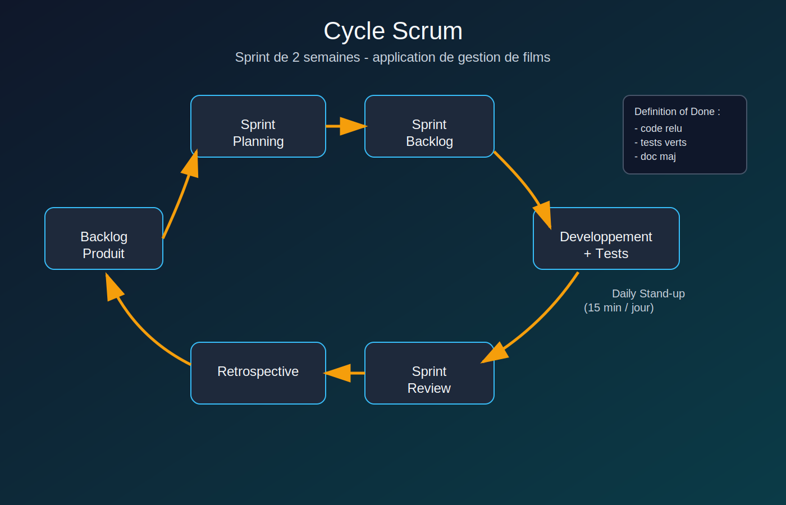
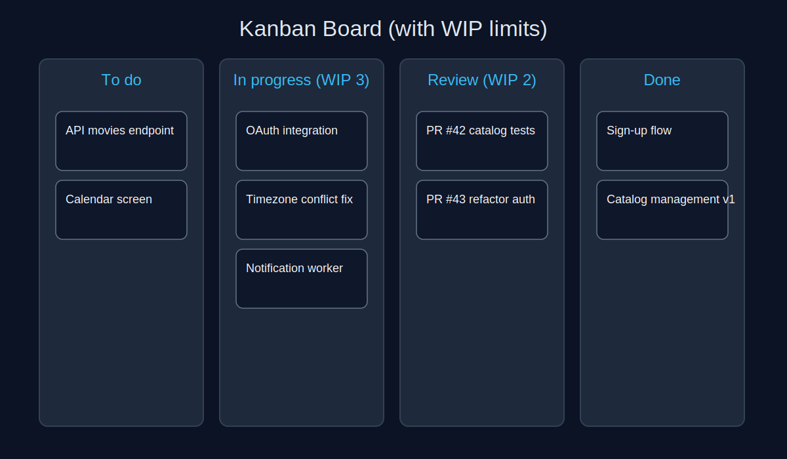
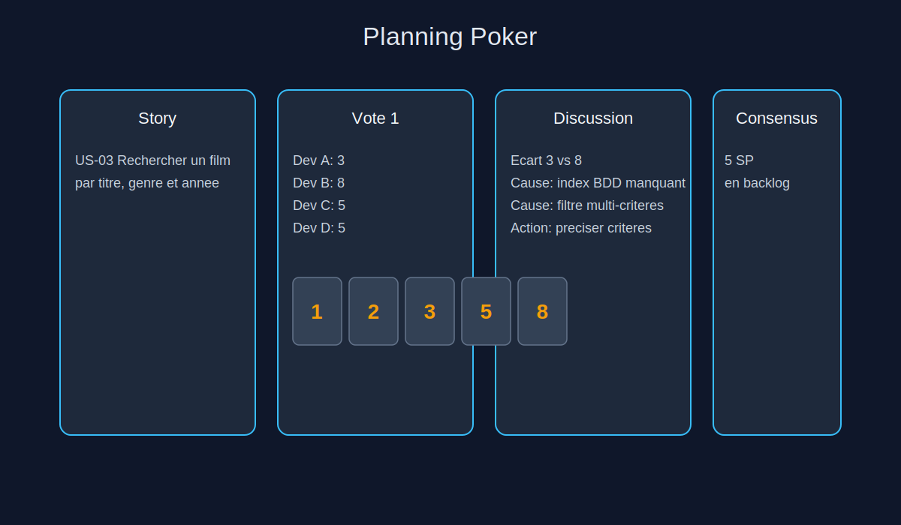
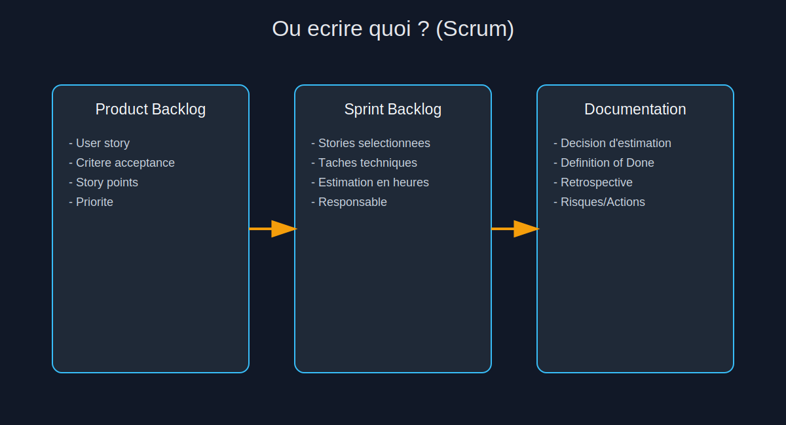
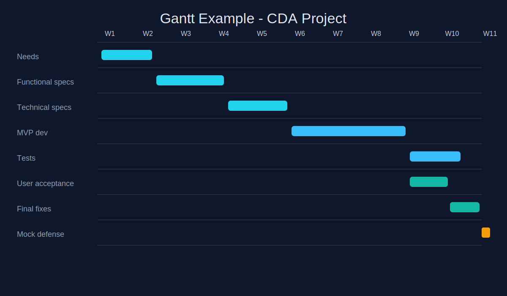
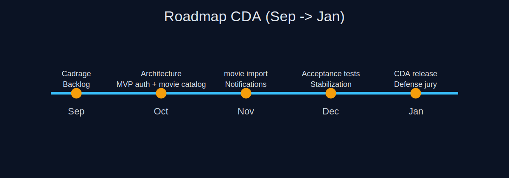
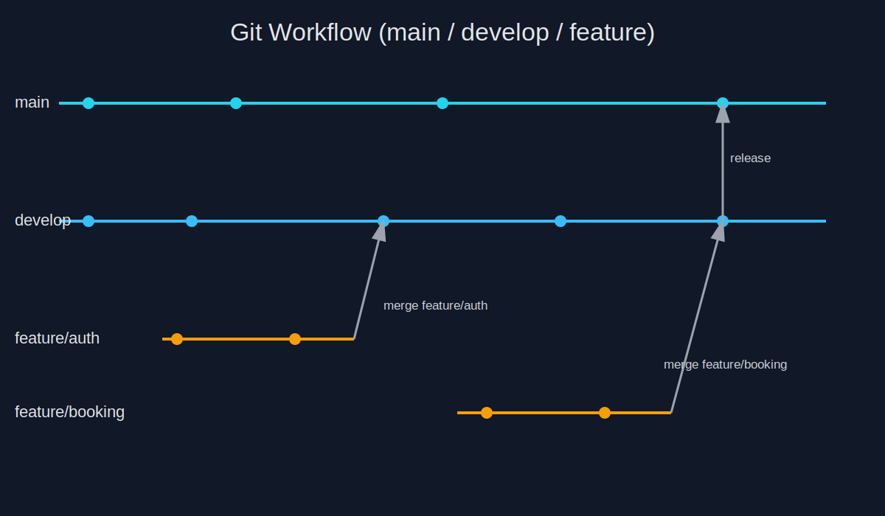
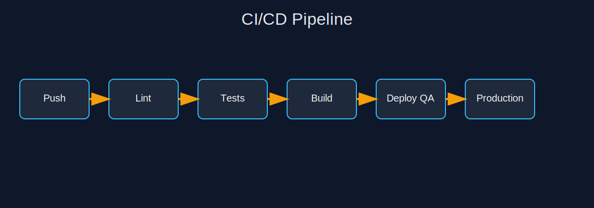
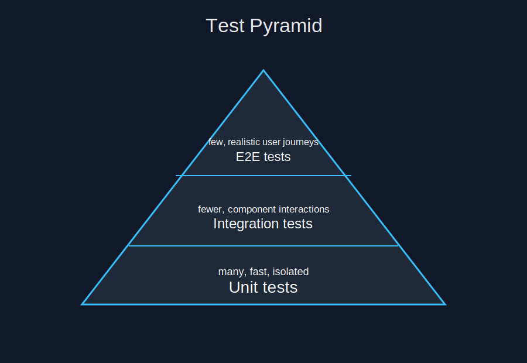

# Outils essentiels de gestion de projet pour le titre CDA

Ce chapitre est conçu pour un **cours CDA orienté pratique**. 

Les sections ci-dessous donnent une méthode, un diagramme et un exemple concret réutilisable dans un dossier projet et en soutenance.

Projet fil rouge utilisé dans les exemples : **application web de gestion de films**.

Tout commence par le cahier des charges 

 Structure recommandée (CDA + Agile)

  1. Contexte et problème à résoudre
  2. Objectifs métier (avec indicateurs de succès)
  3. Périmètre in scope / out of scope
  4. Parties prenantes et rôles
  5. Exigences fonctionnelles (niveau macro: epics)
  6. Exigences non fonctionnelles (sécurité, perf, RGPD, accessibilité, disponibilité)
  7. Contraintes (techniques, budget, délais, outils imposés)
  8. Livrables attendus
  9. Critères d’acceptation globaux
  10. Risques, hypothèses, dépendances
  11. Gouvernance projet (rituels, validation, gestion des changements)

### Remarque sur le cahier des charges

 Le cahier des charges arrive au début, avant les US détaillées.

  Ordre logique :

  1. Cahier des charges (besoin global, périmètre, contraintes, objectifs, non-fonctionnel)
  2. Découpage en epics / user stories
  3. Refinement des US
  4. Planning poker
  5. Sprint planning

  En Agile, le cahier des charges n’est pas “jeté” ensuite :

  - il sert de cadre de référence,
  - puis le détail vivant passe dans le Product Backlog (US + critères d’acceptation).

  Pour ton CDA :

  - cahier des charges dans la partie “expression des besoins” du dossier projet,
  - puis preuve d’exécution dans backlog, planning, tests, etc.

## 1. Méthodologies Agile

### 1.1 Scrum

Scrum structure le travail en cycles courts appelés **sprints** (souvent 2 semaines).



Rôles clés :

- **Product Owner** : priorise le backlog selon la valeur métier.
- **Scrum Master** : facilite l'équipe et supprime les blocages.
- **Équipe de développement** : conçoit, développe, teste, documente.

Rituels clés :

- Sprint Planning : réunion de début de sprint pour choisir les stories à livrer et planifier le travail.
- Daily Stand-up : point quotidien court pour synchroniser l'équipe et signaler les blocages.
- Sprint Review : démonstration de ce qui a été livré en fin de sprint avec feedback des parties prenantes.
- Rétrospective : réunion d'amélioration continue en fin de sprint pour ajuster la façon de travailler.

Rappel 

1. Écrire les US (avec critères d'acceptation).
1. Faire le refinement pour clarifier [#methode]
1. Faire le planning poker pour estimer en story points.
1. Prioriser le Product Backlog.
1. En Sprint Planning, sélectionner les US du sprint et les découper en tâches.

#### Voici une méthode simple et efficace pour le refinement.

  1. Préparer (PO, avant la réunion)

  - Choisir 5 à 10 US candidates pour les 1-2 prochains sprints.
  - Ajouter contexte métier + maquette/lien si dispo.
  - Rédiger des critères d’acceptation initiaux.

  2. Réunion de refinement (45 à 90 min)

  - Participants : PO + équipe dev (+ Scrum Master).
  - Pour chaque US :
      - Le PO explique le besoin métier.
      - L’équipe pose les questions (fonctionnel, technique, sécurité, perf).
      - Vous identifiez dépendances, risques, données nécessaires.
      - Si trop grosse : découpage en US plus petites.
      - Vous reformulez les critères d’acceptation jusqu’à ce qu’ils soient testables.


  - claire et comprise par tous,
  - valeur métier explicite,
  - critères d’acceptation testables,
  - taille raisonnable (faisable en sprint),
  - dépendances connues,
  - pas de blocage majeur.

  4. Après refinement

  - Mettre à jour le Product Backlog (Jira/Trello) :
      - description finale,
      - critères d’acceptation,
      - priorité.
  - Ensuite seulement : planning poker (story points).

  Exemple rapide (film app)
  US brute : “Rechercher un film”
  US clarifiée :

  - filtres : titre partiel, genre, année,
  - tri : titre asc/desc,
  - critère perf : réponse < 500 ms sur 10k films,
  - cas d’erreur défini (aucun résultat, paramètres invalides).

#### Exemple concret 

Sprint 1 de 2 semaines :

- User story 1 : "En tant qu'utilisateur, je peux créer un compte".
- User story 2 : "En tant qu'utilisateur, je peux ajouter un film au catalogue".
- Définition de fini : code relu, tests passants, documentation API à jour.

Exemple de template de user story en `md`:

```md
### US-01 - Ajouter un film
En tant qu'administrateur
Je veux ajouter un film (titre, realisateur, annee, genre)
Afin d'enrichir le catalogue

Critere d'acceptation:
- etant donne des champs valides, quand je confirme, alors le film est enregistre
- etant donne un titre vide, alors un message d'erreur est affiche
```

Rappel de la structure d'une `US`

```txt
- ID (US-01)
- Titre
- Formulation “En tant que… je veux… afin de…”
- Critères d'acceptation
- Priorité
- Story points (après planning poker)
```

### 1.2 Kanban

Kanban pilote le flux de travail en continu avec limitation du WIP (Work In Progress).




#### Exemple concret (CDA)

Tableau de suivi :

- `A faire` : créer endpoint `/movies`, écran catalogue.
- `En cours` : filtre multi-critères (titre, genre, année).
- `En revue` : pull request "fix pagination on movie list".
- `Test` : test E2E création + recherche de film.

### 1.3 Planning Poker : estimer la difficulté en Scrum

Le planning poker sert à estimer des **user stories** en **story points**.

Règle clé : on n'estime pas en heures.  
On estime une difficulté relative selon 4 axes :

- complexité technique,
- volume de travail,
- incertitude,
- risque.



#### Échelle recommandée

Fibonacci : `1, 2, 3, 5, 8, 13, 21`.

#### Déroulé d'une session

1. Le Product Owner lit la story et ses critères d'acceptation.
2. L'équipe pose les questions (fonctionnel + technique).
3. Chaque membre choisit une carte en secret.
4. Révélation simultanée.
5. Discussion entre la valeur la plus basse et la plus haute.
6. Nouveau vote.
7. Valeur finale enregistrée dans le backlog.

#### Mini application de gestion de films : estimation exemple

| ID | User story | Points | Pourquoi |
|---|---|---|---|
| US-01 | Créer un film | 3 | CRUD simple avec validation |
| US-02 | Lister les films paginés | 5 | pagination + tri + perfs |
| US-03 | Rechercher par titre/genre/année | 8 | filtres combinés + index BDD |
| US-04 | Modifier/Supprimer un film | 3 | logique CRUD standard |
| US-05 | Auth admin pour gérer le catalogue | 8 | sécurité + rôles + tests |
| US-06 | Upload d'affiche film | 5 | stockage fichier + contrôle format |

Total backlog initial : **32 story points**.

#### Exemple de code réel à estimer (ce que l'équipe voit en refinement)

Endpoint Express pour la recherche multi-critères :

```ts
app.get('/movies', async (req, res) => {
  const { title, genre, year, page = '1', limit = '10' } = req.query;
  const filters: string[] = [];
  const values: unknown[] = [];

  if (title) {
    values.push(`%${title}%`);
    filters.push(`title ILIKE $${values.length}`);
  }
  if (genre) {
    values.push(genre);
    filters.push(`genre = $${values.length}`);
  }
  if (year) {
    values.push(Number(year));
    filters.push(`year = $${values.length}`);
  }

  const where = filters.length ? `WHERE ${filters.join(' AND ')}` : '';
  const offset = (Number(page) - 1) * Number(limit);
  values.push(Number(limit), offset);

  const sql = `
    SELECT id, title, genre, year
    FROM movies
    ${where}
    ORDER BY title ASC
    LIMIT $${values.length - 1} OFFSET $${values.length}
  `;

  const result = await db.query(sql, values);
  res.json(result.rows);
});
```

Ce qui augmente la difficulté (et donc les points) :

- requête SQL dynamique,
- pagination,
- performance sur gros volume,
- risque d'oublier les index BDD.

#### Où ça s'écrit concrètement ?



- **Product Backlog (Jira/Trello)** : user story, critères d'acceptation, priorité, story points.
- **Sprint Backlog (Jira/Trello, vue sprint)** : stories sélectionnées + tâches techniques + estimation en heures des tâches.
- **Documentation (Notion/Confluence)** : hypothèses d'estimation, Definition of Done, décisions prises en refinement.

Exemple de fiche story à renseigner dans Jira :

```md
US-03 - Rechercher un film
- Story points: 8
- Priorite: High
- Critere 1: recherche par titre partiel
- Critere 2: filtre combinable genre + annee
- Critere 3: temps de reponse < 500 ms sur 10k films
```

#### Atelier interactif (30 minutes en cours)

1. Former des groupes de 4.
2. Distribuer 6 stories de l'application de films.
3. Voter en planning poker (2 tours max par story).
4. Comparer les estimations entre groupes.
5. Décider d'un backlog final commun et expliquer les écarts.

## 2. Outils de planification

### 2.1 Diagramme de Gantt

Le Gantt sert à visualiser tâches, durées, dépendances et jalons.




#### Exemple concret (CDA)

Si le développement prend 5 jours de plus :

- décaler les tâches non critiques,
- garder la date de soutenance blanche,
- réduire le périmètre (fonctionnalités secondaires en lot 2).

### 2.2 Roadmap

La roadmap donne une vision macro des jalons.




## 3. Outils de collaboration

### 3.1 Trello / Jira

Usage attendu :

- découper en tickets courts et mesurables,
- assigner un responsable,
- poser des critères d'acceptation,
- suivre l'avancement quotidien.

#### Exemple de ticket Jira

- **Titre** : "US-03 - Rechercher un film"
- **Description** : API + écran de recherche multi-critères
- **Critères d'acceptation** :
  - la recherche par titre partiel fonctionne,
  - les filtres genre et année sont combinables,
  - temps de réponse < 500 ms sur jeu de données de test,
  - test unitaire et test API passants.

Exemple de payload JSON pour créer un ticket via API Jira :

```json
{
  "fields": {
    "project": { "key": "CDA" },
    "summary": "US-03 - Rechercher un film",
    "description": "API + ecran de recherche multi-criteres + tests",
    "issuetype": { "name": "Story" },
    "priority": { "name": "High" },
    "customfield_10016": 8
  }
}
```

### 3.2 Confluence / Notion

Documentation minimale à tenir à jour :

- décisions d'architecture,
- conventions Git,
- plan de tests,
- compte-rendu des rétrospectives.


## 4. Suivi de version avec Git

Compétences attendues pour un CDA :

- stratégie de branches claire,
- commits atomiques et lisibles,
- pull/merge requests systématiques,
- revues de code traçables.




#### Exemple de convention de commit

- `feat(movies): ajout endpoint creation film`
- `fix(search): correction filtre annee`
- `test(movies): ajout tests recherche multicriteres`

Exemple de sequence Git (feature -> PR -> merge) :

```bash
git checkout develop
git pull origin develop
git checkout -b feature/catalog
git add .
git commit -m "feat(catalog): create movie search endpoint"
git push -u origin feature/catalog
# Puis ouvrir une Pull Request vers develop
```

## 5. CI/CD (intégration et déploiement continus)

Objectif : automatiser la qualité et la livraison.




#### Exemple minimal GitHub Actions

```yaml
name: ci
on: [push, pull_request]
jobs:
  test:
    runs-on: ubuntu-latest
    steps:
      - uses: actions/checkout@v4
      - uses: actions/setup-node@v4
        with:
          node-version: 20
      - run: npm ci
      - run: npm run lint
      - run: npm test
```

## 6. Qualité et tests

La qualité doit être visible par des preuves (tests, rapports, métriques).



### 6.1 Pyramide de tests


### 6.2 Exemples de tests

Exemple Jest (JavaScript) :

```js
test('filtre les films par genre', () => {
  const movies = [
    { title: 'Inception', genre: 'Sci-Fi' },
    { title: 'Titanic', genre: 'Romance' }
  ];
  expect(filterByGenre(movies, 'Sci-Fi')).toHaveLength(1);
});
```

Exemple PHPUnit (PHP) :

```php
public function testFilterByYear(): void
{
    $movies = [
        ['title' => 'Heat', 'year' => 1995],
        ['title' => 'Dune', 'year' => 2021],
    ];

    $this->assertCount(1, filterByYear($movies, 2021));
}
```

### 6.3 Suivi SonarQube (exemple d'objectifs)

- couverture de tests > 80 % sur le module critique,
- aucune vulnérabilité bloquante,
- duplications limitées,
- dette technique suivie sprint par sprint.

Exemple minimal de configuration SonarQube :

```properties
sonar.projectKey=cda-films
sonar.projectName=CDA Films
sonar.sources=src
sonar.tests=tests
sonar.javascript.lcov.reportPaths=coverage/lcov.info
sonar.sourceEncoding=UTF-8
```

## 7. Rétrospectives et feedback

Les rétrospectives servent à améliorer le process, pas à juger les personnes.

### 7.1 Format Start / Stop / Continue (exemple)

- **Start** : formaliser les critères d'acceptation avant dev.
- **Stop** : fusionner des PR non relues.
- **Continue** : daily de 15 minutes max.

### 7.2 Plan d'actions type

| Action | Responsable | Échéance | Indicateur |
|---|---|---|---|
| Template de ticket obligatoire | Scrum Master | Sprint +1 | 100 % tickets complets |
| Revue PR sous 24h | Dev team | Sprint +1 | délai moyen < 24h |
| Dashboard Sonar partagé | Lead dev | Sprint +1 | métriques visibles chaque semaine |

## 8. Cas complet à présenter en soutenance CDA

Chaîne de valeur recommandée dans la présentation :

1. besoin métier -> backlog priorisé,
2. estimation planning poker (story points),
3. planification Gantt + roadmap,
4. tickets Jira/Trello et documentation Confluence/Notion,
5. branches Git et revues de code,
6. pipeline CI/CD,
7. résultats de tests + SonarQube,
8. amélioration continue via rétrospectives.

## 9. Niveau de précision attendu pour un dossier CDA

Pour chaque axe, il faut montrer des éléments concrets et mesurables.

### 9.1 Agile

- backlog priorisé avec critères d'acceptation par user story,
- historique d'estimation planning poker (votes et consensus),
- compte-rendu de sprint review,
- actions issues de la rétrospective précédente et leur statut.

### 9.2 Planification

- Gantt initial + version mise à jour,
- justification des écarts (retards, changement de périmètre),
- roadmap avec jalons réellement atteints.

### 9.3 Collaboration

- extrait de board Jira/Trello (tickets du sprint),
- pages de documentation (architecture, ADR, API),
- preuve de communication (compte-rendu de réunion ou décision).

### 9.4 Git et qualité de code

- historique de commits lisibles,
- pull requests annotées avec commentaires de revue,
- conventions de branchement appliquées.

### 9.5 CI/CD et tests

- exécutions pipeline vertes (logs ou captures),
- rapport de tests (unitaires/integration/E2E),
- indicateurs SonarQube (couverture, duplications, vulnérabilités).

## 10. Glossaire des termes techniques du chapitre

| Terme | Définition précise | Exemple |
|---|---|---|
| Agile | Approche itérative de gestion de projet basée sur des cycles courts et l'adaptation continue. | Ajuster le backlog à chaque sprint selon les retours métier. |
| Scrum | Cadre Agile structuré par rôles, artefacts et cérémonies. | Sprint de 2 semaines avec planning, daily, review, rétro. |
| Sprint | Période timeboxée où l'équipe livre un incrément fonctionnel. | Sprint du 1er au 14 octobre. |
| Refinement (Backlog Refinement) | Atelier de clarification des stories avant sprint planning. | L'équipe précise US-03 et ajoute les critères de performance. |
| Planning Poker | Technique d'estimation collective avec cartes, discussion et consensus. | Votes 3/5/8 puis convergence à 5 points. |
| Story point | Unité d'estimation relative de difficulté d'une story. | US-03 \"Recherche multi-critères\" = 8 points. |
| Estimation relative | Méthode qui compare les stories entre elles, sans conversion directe en heures. | US-02 est estimée plus simple que US-03, donc moins de points. |
| Velocity | Nombre moyen de story points terminés par sprint. | L'équipe termine 24 points en moyenne par sprint. |
| Backlog produit (Product Backlog) | Liste priorisée des besoins métier à réaliser. | US-03 \"Rechercher un film\" priorisée en haut de backlog. |
| Sprint backlog | Sous-ensemble du backlog produit sélectionné pour le sprint en cours. | 6 stories retenues pour Sprint 3. |
| Product Owner | Responsable de la valeur métier et de la priorisation des besoins. | Valide l'ordre des user stories avant le sprint planning. |
| Scrum Master | Facilitateur qui garantit l'application de Scrum et supprime les blocages. | Débloque un accès serveur pour l'équipe. |
| Daily Stand-up | Réunion quotidienne courte de synchronisation d'équipe. | 15 minutes chaque matin à 9h30. |
| Sprint Planning | Cérémonie de planification du sprint. | Sélection des stories et estimation de charge. |
| Sprint Review | Démonstration de l'incrément au métier en fin de sprint. | Démo de la fonctionnalité de recherche de films. |
| Rétrospective | Cérémonie d'amélioration continue centrée sur le processus. | Action décidée : revue PR sous 24h. |
| User story | Formulation d'un besoin du point de vue utilisateur. | \"En tant qu'utilisateur, je peux rechercher un film par genre.\" |
| Critère d'acceptation | Condition vérifiable qui valide une user story. | \"La recherche répond en moins de 500 ms.\" |
| Definition of Done (DoD) | Règle commune décrivant ce qui est considéré comme \"terminé\". | Code revu, tests verts, doc mise à jour. |
| Kanban | Méthode de pilotage visuel en flux continu avec limitation du WIP. | Tableau \"A faire / En cours / En revue / Terminé\". |
| WIP (Work In Progress) | Nombre maximal de tâches simultanément en cours. | WIP = 3 sur la colonne \"En cours\". |
| Temps de cycle (Cycle Time) | Temps entre le début de traitement d'une tâche et sa fin. | Ticket démarré lundi, terminé jeudi : 4 jours. |
| Lead Time | Temps total entre la demande et la livraison finale. | Demande client lundi, livraison lundi suivant. |
| Diagramme de Gantt | Représentation temporelle des tâches, dépendances et jalons. | Visualiser le chemin jusqu'à la soutenance blanche. |
| Jalon (Milestone) | Point clé sans durée servant de repère de pilotage. | \"MVP validé\" le 15/11. |
| Dépendance | Relation d'ordre entre tâches (une tâche attend une autre). | Les tests d'intégration commencent après le dev MVP. |
| Chemin critique | Suite de tâches dont le retard décale la date finale du projet. | Spécifications -> dev -> recette -> livraison. |
| Roadmap | Vision macro des objectifs et jalons sur une période longue. | Jalons mensuels Septembre à Janvier. |
| MVP (Minimum Viable Product) | Version minimale utile livrable pour valider la valeur métier. | Authentification + catalogue films sans upload affiche. |
| Ticket | Unité de travail traçable dans un outil de gestion. | Ticket JIRA CDA-54. |
| Trello | Outil de gestion visuelle de tâches type Kanban. | Cartes déplacées entre colonnes. |
| Jira | Outil de suivi de projet/tickets orienté Agile. | Sprint board + backlog + reporting. |
| Confluence | Wiki d'équipe pour documenter décisions et procédures. | Page \"Architecture API v1\". |
| Notion | Outil de documentation/collaboration structurant notes et bases de connaissance. | Base \"décisions techniques\" partagée. |
| Git | Système de gestion de versions distribué pour suivre le code source. | Historique des changements par commit. |
| Dépôt (Repository) | Espace contenant le code, l'historique Git et la documentation. | Repo GitHub `cda-films`. |
| Branche (Branch) | Ligne de développement isolée. | `feature/catalog`, `fix/search-year`. |
| Commit | Enregistrement atomique d'un changement versionné. | `feat(movies): ajout endpoint creation film`. |
| Merge | Fusion de l'historique d'une branche vers une autre. | Fusion de `feature/catalog` vers `develop`. |
| Pull Request / Merge Request | Demande de revue avant fusion d'une branche. | PR #42 avec 2 approbations. |
| CI (Continuous Integration) | Intégration continue : validations automatiques à chaque push. | Lint + tests exécutés automatiquement. |
| CD (Continuous Delivery/Deployment) | Automatisation de la livraison ou du déploiement. | Déploiement en recette après pipeline vert. |
| Pipeline | Chaîne d'étapes automatisées (build, test, qualité, déploiement). | Workflow GitHub Actions `ci.yml`. |
| Lint | Analyse statique du style et de la qualité syntaxique du code. | `npm run lint` bloque les erreurs ESLint. |
| Build | Étape de compilation/assemblage des artefacts applicatifs. | Construction d'une image Docker. |
| Artefact | Fichier produit par le build (binaire, image, package). | Image `app:1.2.0` publiée au registry. |
| Environnement de recette | Environnement de validation avant production. | URL de preprod pour tester les features. |
| Production | Environnement réellement utilisé par les utilisateurs finaux. | Application accessible aux clients. |
| Rollback | Retour à une version stable en cas d'incident. | Revenir de `v1.2.1` vers `v1.2.0`. |
| Test unitaire | Test d'une unité de code isolée. | Vérifier la fonction de filtre par genre. |
| Test d'intégration | Test de l'interaction entre plusieurs composants. | API + base de données sur scénario complet. |
| Test E2E (End-to-End) | Test du parcours utilisateur de bout en bout. | Créer un compte puis ajouter un film au catalogue. |
| Couverture de tests | Pourcentage de code exécuté pendant les tests. | 82 % de couverture sur le module catalogue films. |
| SonarQube | Plateforme d'analyse continue de qualité et sécurité de code. | Détection de duplications et vulnérabilités. |
| Code smell | Indice de mauvaise qualité de conception, sans bug direct immédiat. | Méthode trop longue et difficile à maintenir. |
| Dette technique | Coût futur induit par des choix techniques rapides/non pérennes. | Patch rapide à refactoriser dans le sprint suivant. |
| Duplication de code | Répétition de blocs de code augmentant le risque d'erreurs. | Même validation copiée dans 4 contrôleurs. |
| Vulnérabilité | Faiblesse exploitable compromettant sécurité/confidentialité/intégrité. | Injection SQL via entrée non filtrée. |
| OAuth | Protocole d'autorisation déléguée sans partager le mot de passe utilisateur. | Connexion via Google. |
| API (Application Programming Interface) | Contrat d'échange entre systèmes logiciels. | Endpoint `POST /movies`. |
| Endpoint | Point d'accès HTTP d'une API identifié par une URL et une méthode. | `GET /movies/{id}`. |

## 11. Activités interactives prêtes à animer

### Activité A : Planning poker live (30 min)

- **Objectif** : comprendre l'estimation relative.
- **Support** : 6 stories du backlog films.
- **Livrable apprenant** : backlog priorisé avec story points.

### Activité B : Sprint planning simulé (30 min)

- **Contrainte** : velocity équipe = 20 points.
- **Tâche** : choisir les stories qui entrent dans le sprint 1.
- **Livrable apprenant** : sprint backlog + justification des choix.

### Activité C : Revue + rétro (20 min)

- **Entrée** : un sprint fictif avec 2 stories terminées et 1 bloquée.
- **Tâche** : faire une review de 5 minutes puis une rétro Start/Stop/Continue.
- **Livrable apprenant** : 3 actions d'amélioration mesurables.

## Synthèse

Pour convaincre le jury, il faut montrer des **preuves projet** :

- captures de backlog/tableau,
- extrait de Gantt et roadmap,
- exemples de PR et historique Git,
- pipeline CI/CD exécuté,
- rapports de tests et qualité,
- décisions d'amélioration issues des rétrospectives.
